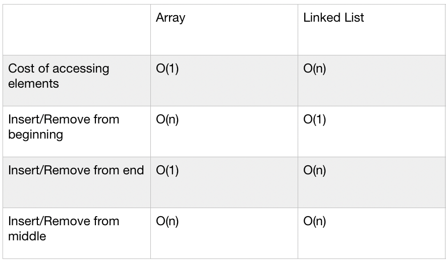

# Singly Linked List
A Singly Linked List is an ordered collection of data elements. It is a dynamic data structure, that is it can be of any length. It can store data of any type.

A Singly Linked List consists of two parts; the Node, and the link. The Node in turn has two sections; the data field (which holds the data), and the link field (which holds the link to the next element).

Singly Linked Lists contains links to only the next elements in the Linked Lists, thus making it traversable in only that direction.

## Challenge
manipulate linked list :
Creat a linked list 
add elements to it(insert at first , append and insert to specific index)

## Approach & Efficiency
Big O for diferent methods applied to Linked List

## API
Methods i used to create and edit linked list :
   - insert_values --> insert to empty array 
   - insert_at_beginning --> insert to head
   - insert_at_end --> appened 
   - get_length --> length of list
   - remove_at_index --> remove element at a given index 
   - insert_at --> insert element at a given index 
   - includes --> to find if element is exist or not : return true if available or false if not
   - insert_after_value --> find a spicific value --> determain the location of it --> insert a given value after it
   - remove_by_value --> find a spicific value --> determain the location of it --> remove it 
   - __str__ 

- [linked list - code](./linked_list.py)
- [linked list - test](./test_linked_list.py)