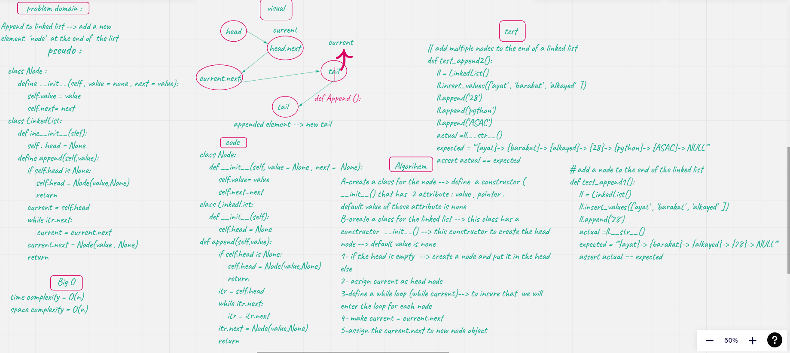
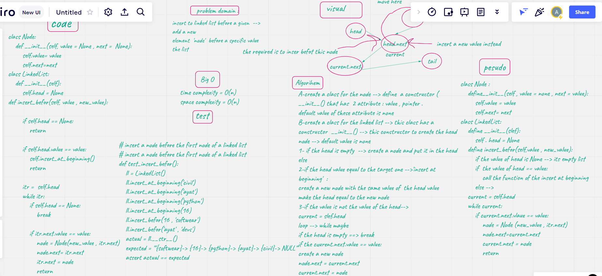
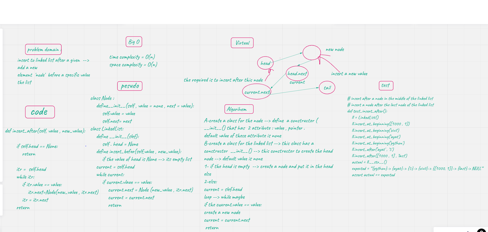

# Challenge Summary
>> applied to a linked list 3 methods 
append --> append elements at the end of the list
insert before --> insert element before a given element
insert after --> insert element after a given element

## Whiteboard Process
### append

### insert before

### insert after

## Approach & Efficiency
all of these 3 methods have O(n) comlexity in each of time and space

## Solution
solution for these 3 problems was provided as white board and python file code 

